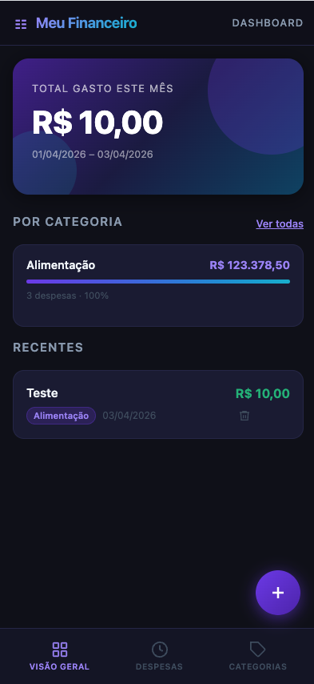
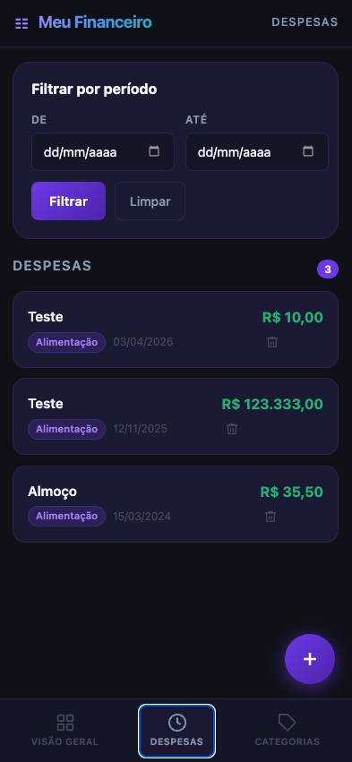
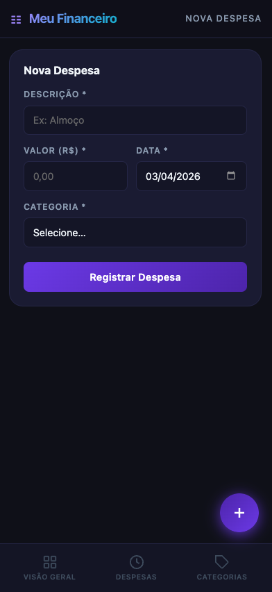
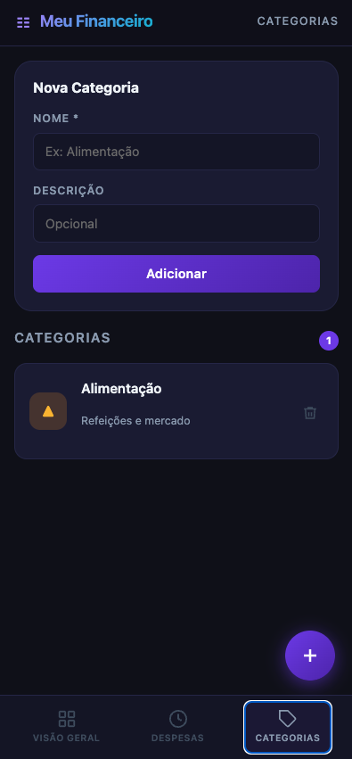

# Meu Financeiro — Frontend

SPA (Single Page Application) de controle de gastos pessoais, desenvolvida com HTML, CSS e JavaScript puro (sem frameworks SPA). Interface mobile-first que consome todos os endpoints da [controle-gastos-api](https://github.com/hmartiins/mvp-fullstack-backend-puc-rio).

---

## Screenshots

<!-- Insira os prints da aplicação abaixo -->

| Dashboard                              | Despesas                              |
| -------------------------------------- | ------------------------------------- |
|  |  |

| Nova Despesa                     | Categorias                             |
| -------------------------------- | -------------------------------------- |
|  |  |

---

## Tecnologias

- **HTML5** — estrutura semântica da SPA
- **CSS3** — estilização customizada mobile-first (dark theme, animações, layout em grid/flex)
- **JavaScript (ES2020)** — lógica da aplicação, navegação e consumo da API via `fetch`

---

## Estrutura de arquivos

```
├── index.html          # Ponto de entrada — abre direto no navegador
├── css/
│   ├── variables.css   # Tokens de design (cores, espaçamentos, sombras)
│   ├── layout.css      # Header, área de conteúdo, animação de página
│   ├── dashboard.css   # Hero card, barras de resumo por categoria
│   ├── cards.css       # Cards de despesas e categorias
│   ├── forms.css       # Formulários, inputs e filtro por período
│   ├── buttons.css     # Botões (primary, ghost, danger)
│   ├── modal.css       # Modal de detalhes (bottom sheet)
│   ├── nav.css         # Barra de navegação inferior
│   └── utils.css       # Toast, empty state, FAB (floating action button)
└── js/
    ├── api.js          # Cliente HTTP — todas as rotas da API
    ├── utils.js        # Helpers: seletores DOM, formatação de moeda e data
    ├── toast.js        # Notificações não-bloqueantes
    ├── despesas.js     # Listagem, filtro, exclusão e modal de detalhes
    ├── dashboard.js    # Visão geral: total do mês, resumo e recentes
    ├── categorias.js   # Listagem, criação e exclusão de categorias
    ├── nova.js         # Formulário de nova despesa
    ├── router.js       # Navegação entre páginas (hash-less SPA)
    └── app.js          # Inicialização da aplicação
```

---

## Como executar

### 1. Suba a API

```bash
git https://github.com/hmartiins/mvp-fullstack-backend-puc-rio.git
cd mvp-fullstack-backend-puc-rio
pip install -r requirements.txt
python app.py
```

A API ficará disponível em `http://localhost:5001`.

### 2. Abra o frontend

Basta abrir o arquivo `index.html` diretamente no navegador — sem servidor local, sem extensões, sem configuração adicional.

```
open mvp-fullstack-frontend-puc-rio/index.html
```

---

## Páginas da aplicação

| Página           | Descrição                                                                                                                                |
| ---------------- | ---------------------------------------------------------------------------------------------------------------------------------------- |
| **Visão Geral**  | Total gasto no mês atual, breakdown por categoria com barras de progresso e 5 despesas mais recentes                                     |
| **Despesas**     | Lista completa de despesas em cards; filtro por período (data início/fim); clique em um card abre modal de detalhes com opção de excluir |
| **Nova Despesa** | Formulário para registrar uma nova despesa (descrição, valor, data, categoria) — acessado pelo botão flutuante (FAB)                     |
| **Categorias**   | Lista de categorias com total gasto em cada uma; formulário inline para criação; exclusão individual                                     |

---

## Rotas da API consumidas

| Método   | Endpoint            | Utilizada em                  |
| -------- | ------------------- | ----------------------------- |
| `GET`    | `/categorias`       | Categorias, Nova Despesa      |
| `POST`   | `/categorias`       | Categorias                    |
| `DELETE` | `/categorias/:id`   | Categorias                    |
| `GET`    | `/despesas`         | Despesas                      |
| `GET`    | `/despesas/:id`     | Modal de detalhes             |
| `POST`   | `/despesas`         | Nova Despesa                  |
| `DELETE` | `/despesas/:id`     | Despesas, Modal, Dashboard    |
| `GET`    | `/despesas/resumo`  | Dashboard, Categorias         |
| `GET`    | `/despesas/periodo` | Dashboard, Filtro de despesas |
